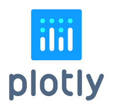

## Hi there 👋 I'm Ahmed Sabre 
   
  

# I'm a Data Scientist, Technical Writer, Machine Learning Scientist, Data Analyst, NLP Engineer, Computer Vision Engineer,Data Driven Decision Maker            
- 🔭 I’m currently working on Data Scientist & Machine Learning Engineer
- 🌱 I’m currently learning Generative AI
- 👯 I’m collaborator of opensource ML projects and looking for more collaboration
- 🤔 I’m looking for help with driving business growth with data driven solutions.
- 🥅 Goals:Explore the more and more research of Computer vision,Deep learning,NLP,TimeSeries Analysis and Data Driven Decision Making.
- ⚡ Fun fact: I love to code and solving problems. Love problems 💪

---
  

  <b>My GitHub Stats</b> 
    
    
    
    
  
                  <b>⚡ Technologies I use </b>
      

    <table align="center">
        <tr>
            <td align="center" width="140" height="112.43">
                
                  Python
            </td>
            <td align="center" width="140" height="112.43">
                
                  Jupyter
            </td>
            <td align="center" width="140" height="112.43">
                
                  TensorFlow
            </td>
            <td align="center" width="140" height="112.43">
                
                 
            </td>
            <td align="center" width="140" height="112.43">
                
                  Scikit Learn
            </td>
            <td align="center" width="140" height="112.43">
                
                 
            </td>
            <td align="center" width="140" height="112.43">
                
                  Kaggle
            </td>
        </tr>
    </table>
    

***Thanks for visiting my profile.***

